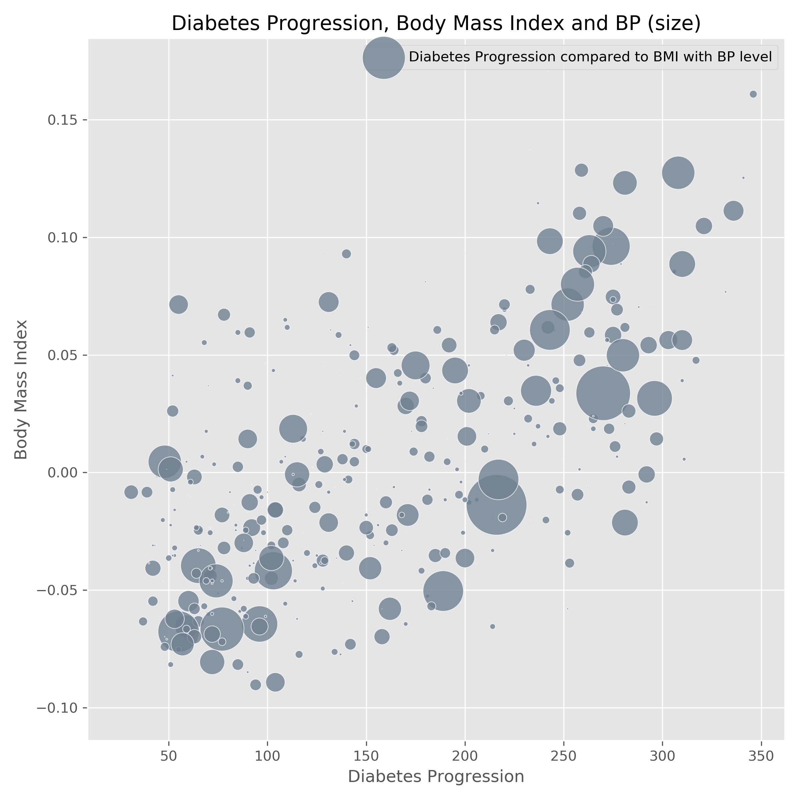

# cebd-1160-final-project

| Name | Date |
|:-------|:---------------|
|Lucia Di Sclafani|November 30, 2019|

-----

### Resources
Your repository should include the following:

- Python script for your analysis: `bmi_diabetes_analysis.py`
- Results figure/saved file:  `figures/`
- Dockerfile for your experiment: `Dockerfile`
- runtime-instructions in a file named RUNME.md

-----

## Research Question

Can the progression of diabetes be predicted by body mass index?

### Abstract

With the NCSU diabetes sklearn dataset, we can attempt to predict the progression of diabetes based on a variety of factors.
Given that this not a classification issue, we will attempt to predict the progression of diabetes with a linear regression model.
Based on preliminary tests, there seems to be a higher correlation between BMI and the progression of diabetes.
With the performance of the chosen regressor (GradientBoostingRegression), we found that the model's performance isn't entirely clear. There is, however, promise for more sophisticated methods to show more accurate results.

### Introduction

Ten baseline variables, age, sex, body mass index, average blood
pressure, and six blood serum measurements were obtained for each of n =
442 diabetes patients, as well as the response of interest, a
quantitative measure of disease progression one year after baseline.

**Data Set Characteristics:**

  **Number of Instances**: 442  
 
  **Number of Attributes**: First 10 columns are numeric predictive values  
 
  **Target**: Column 11 is a quantitative measure of disease progression one year after baseline  
 
  **Attribute Information**:  
      - Age  
      - Sex  
      - Body mass index  
      - Average blood pressure  
      - S1 *(renamed: Total Cholesterol)*  
      - S2 *(renamed: LDL Cholesterol)*  
      - S3 *(renamed: HDL Cholesterol)*  
      - S4 *(renamed: TCH)*  
      - S5 *(renamed: LTG)*  
      - S6 *(renamed: Glucose)*  

Note: Each of these 10 feature variables have been mean centered and scaled by the standard deviation times `n_samples` (i.e. the sum of squares of each column totals 1).

Source URL:
http://www4.stat.ncsu.edu/~boos/var.select/diabetes.html

For more information see:
Bradley Efron, Trevor Hastie, Iain Johnstone and Robert Tibshirani (2004) "Least Angle Regression," Annals of Statistics (with discussion), 407-499.
(http://web.stanford.edu/~hastie/Papers/LARS/LeastAngle_2002.pdf)

### Methods

**1.** Take a look at the dataset features  
**2.** Visualize the data with seaborn pairplot  
  
 
  
**3.** Identify potential correlation (heatmap and scatter plot)  
**4.** Split the data into train and test sets  
**5.** Use a linear regression model (GradientBoostingRegression)  
**6.** Identify the RMSE  

The pseudocode for the method used can be found [HERE](https://scikit-learn.org/stable/modules/generated/sklearn.ensemble.GradientBoostingRegressor.html). It essentially boosts the regression to get a more accurate prediction.
The data itself was already mean centered and scaled. We then only used the data relevant to solving the problem stated in the beginning (body mass index + diabetes progression).

### Results

The performance of the chosen regressor, Gradient Boosting Regressor, was an R^2 of 0.2751. The figure below shows its performance

METRICS FROM A GRADIENT BOOSTING REGRESSION (GBR)  
 
GBR - MAE error(avg abs residual): 56.05642112710523  
GBR - MSE error: 4605.90724557536  
GBR - RMSE error: 67.86683465121503  
GBR - R2 Score: 0.27516395024661866  
 
 
Given the low R^2 score, we cannot conclude that there is a strong relationship between the progression of diabetes when Body Mass Index increases. However, with the RMSE (67.8668), we can see that the test has been run rather accurately.

### Discussion

The method used does not provide a strong enough solution to the question we tried to resolve. However, with the heatmap and scatter plot created in the beginning (to visualize the data), there can be a more accurate solution to solving the question at hand.
We suggest running the same kind of tests by combining other features from the original dataset to see if a specific combination of factors can in fact predict the progression of diabetes.

### References
The links referenced were included above.

-------